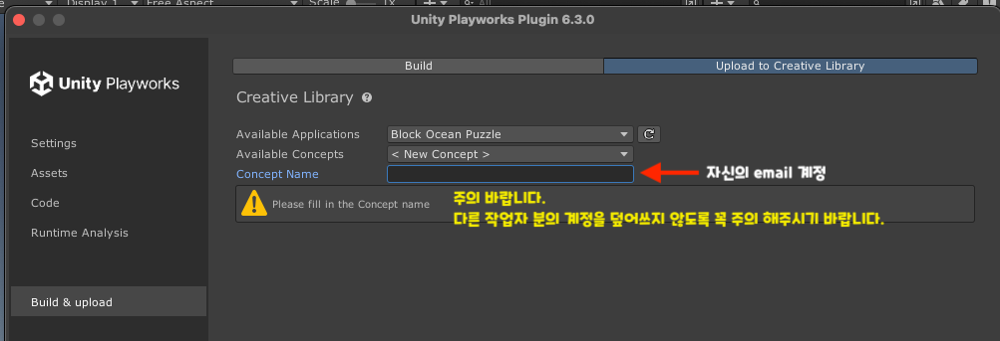

# 🎮 프로젝트 설명
### 본 과제는 Luna Plugin을 이용한 3D 플레이어블 게임 제작을 목적으로 하며,
### 실무에서 사용되는 툴과 구조를 기반으로 구성되어 있습니다.

## 🚨Github을 Fork 하여 프로젝트를 세팅 후 작업 진행 바랍니다.
- 꼭 Merge를 하여 작업물을 관리 해주시기 바랍니다.
- 해당 프로젝트는 계정의 보안상의 이유로 Public이 아닌 Private 로 진행 됩니다.
- LunaPlayground Account 
  - Email : actionfitgames02@gmail.com
  - Password : Action123!
- 프로젝트 마감 
  - 7월 9일 16:00
- 프로젝트 제출 Form (해당 Form 기준으로 마감 처리합니다.)
  - https://forms.gle/kXWLWvyjD4tAN7n88
--- 

## ⚠️ 제작 시 주의사항

- 최종 `.html` 파일 크기는 반드시 **5MB 이하**로 유지해야 합니다.  
  👉 리소스 최적화를 위해 **Size Break** 기능을 꼭 활용해주세요.

- 완성된 파일은 **Unity Playworks**에 업로드해 제출해야 합니다.  
  👉 화면 기준: **Portrait**, Canvas Scale: **640 × 850**

> 위 사항을 꼭 확인해주세요.

---

## 📁 프로젝트 구조

### @Assets
- **Effect**: 파티클 등의 이펙트 에셋 모음
  - Extensions : UI Particle System
  - Prefabs : UI Particle Prefabs [반짝이는 효과]
  - ResourcesData : UI Mat, Shader, Texture 등
- **Images**: HUD, CTA 등의 UI 텍스처 에셋
- **Models**: 게임에 사용되는 3D 모델 에셋
  - Case : 굿즈를 담는 케이스 모델 (fbx)
  - Goods : 굿즈 모델 9종 (fbx + Texture)
### @SampleProjects
- Luna Playable로 제작된 공식 샘플 프로젝트

### @Scenes
- 게임 씬(Scene) 파일이 포함된 폴더

### @Scripts
- 게임 로직 및 동작을 제어하는 스크립트 폴더

---

## ⚙️ Playable Settings

- 📄 [Luna Labs 공식 문서](https://docs.lunalabs.io/docs/playable/getting-started/step-by-step)

| 항목              | 버전/경로       |
|-------------------|-----------------|
| **Editor Version** | 2022.3.60f1     |
| **Luna Playground** | 6.3.0 (../6.3.0) |
| **DOTween**        | 1.2.705         |
| **TMP Pro**        | 3.0.6           |
| **NewtonJson**     | 2.0.0           |

---

## ✅ 평가 기준

- Luna Plugin 문서를 이해하고 사용할 수 있는지
- C# 6~7 문법 기반의 개발 가능 여부
- 기본적인 3D 월드 구성 이해도

---

### 📩 문의 및 제출 안내
- 담당자: 이정훈
- 이메일: jeonghoon@actionfit.kr

### 📌 기타 안내
- 프로젝트는 반드시 완성하지 않으셔도 괜찮습니다.
- **단, 진행 중인 내용이라도 반드시 Github에 Merge**해주세요.  
  → 코드 구조 및 작성 상태 또한 평가에 반영됩니다.